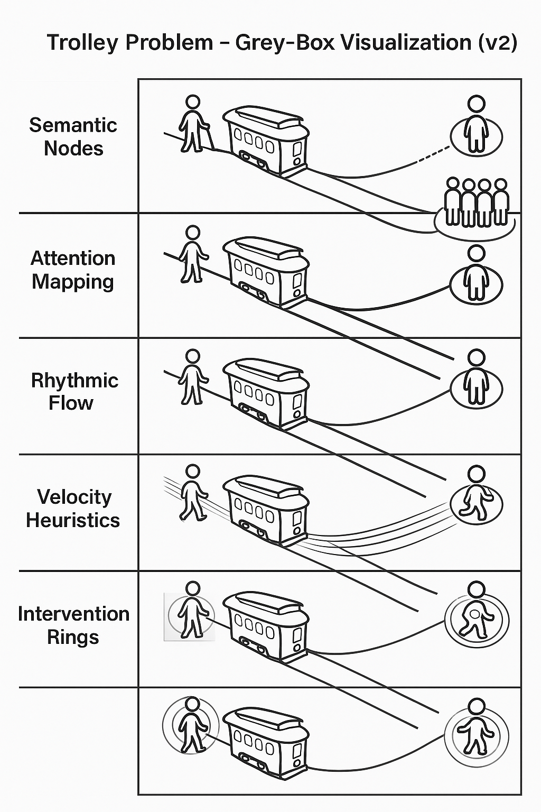
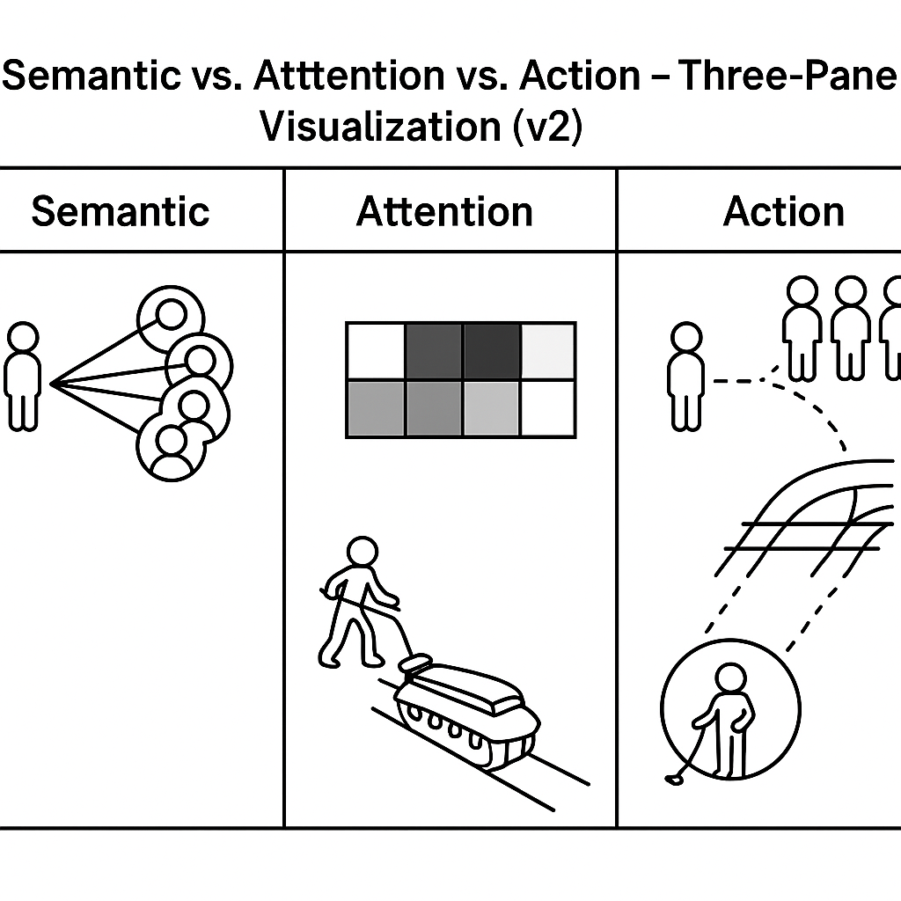

# 🌈 Grey-Box Visualization Framework v2.0  
_A universal six-layer conceptual interpretability framework for LLM reasoning visualization._

> Inspired by SAIIP, but fully model-agnostic and language-agnostic.

---

## 1. What is this?

The **Grey-Box Visualization Framework v2.0** is a six-layer conceptual
interpretability model designed to make large language model (LLM) reasoning:

- more **visible**  
- more **structured**  
- more **teachable**  
- more **reusable** as a visualization template  

It focuses on _how_ models:

- group and relate concepts (semantics)  
- distribute focus (attention)  
- move along reasoning paths (flow)  
- accumulate pressure or importance (heat)  
- accelerate decisions (velocity)  
- expose intervention points (actions)  

This project is **not** a debugging toolkit or gradient probe.  
It is a **human-facing conceptual visualization framework**.

Repo: [GitHub – swmlucky-sudo/saiip-greybox-viz](https://github.com/swmlucky-sudo/saiip-greybox-viz)  
Dataset: (optional) Hugging Face card if you want to link it later.

---

## 2. The Six-Layer Grey-Box Architecture

The framework defines six layers:

1. **Semantic Nodes** – concepts, tokens, contextual units  
2. **Attention Mapping** – weighted focus between nodes  
3. **Semantic Flow** – directional movement of meaning / reasoning  
4. **Heatmap Weight Layer** – importance / moral or structural weight  
5. **Semantic Flow Velocity** – reasoning acceleration or momentum  
6. **Action Intervention Ring** – where actions can change the outcome  

Together, these form a high-level “grey-box” view of model behavior.

---

## 3. Visual Overview (v2 Diagrams)

### 3.1 Grey-Box Framework Overview (v2)

A global overview of the six-layer structure used in this framework.

---

### 3.2 Trolley Problem – Grey-Box Visualization (v2)

A research-style rendering of the Trolley Problem, with:

- semantic grouping of agents and outcomes  
- heatmap weighting of different branches  
- intervention node highlighting the agent at the switch  

---

### 3.3 Semantic vs Attention vs Action – Three-Pane View (v2)

A three-pane comparative visualization of:

- **Semantic View** – how entities are grouped and related  
- **Attention View** – how focus is distributed  
- **Action View** – where interventions can alter the path  

---

## 4. Use Cases

This framework is intended for:

- **Explainable AI (XAI)** education  
- visualizing multi-branch reasoning (e.g., dilemmas)  
- research papers and project pages  
- teaching semantic / attention / causal structure  
- prototyping new visualization styles for LLM internals  

It is fully decoupled from any specific language system.  
SAIIP is acknowledged only as an **origin of inspiration**, not a dependency.

---

## 5. How to Use This Project

This repository does **not** ship a Python library.  
Instead, it provides:

- conceptual documentation (README, CN version, addendum)  
- a set of high-quality diagrams (v2 series)  
- a coherent interpretability framework you can reuse or extend  

You may:

- embed the diagrams in slides, papers, or teaching material  
- adapt the six-layer idea to your own LLM experiments  
- extend the diagrams with your own decision scenarios  
- use it as a design reference for new XAI tools  

License: **MIT** – feel free to reuse with attribution.

---

## 6. Credits

Designed and authored by the project owner.  
Early inspiration from structured poetic analysis (SAIIP),  
later generalized into a fully universal, LLM-agnostic visualization framework.

If you find it useful, a star ⭐ on the GitHub repo is always appreciated.
